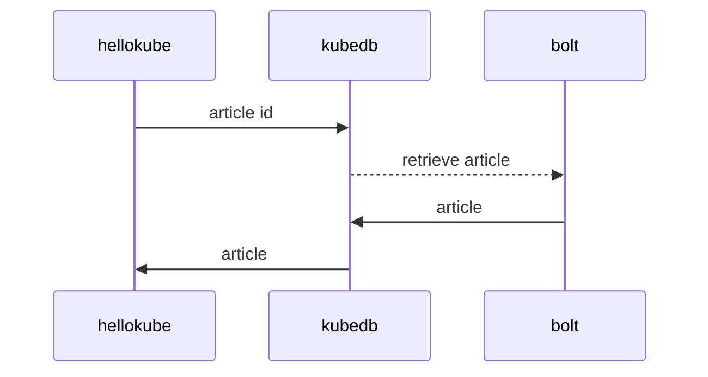

# Hello-kube

Generic little web app to learn some kubernetes, gin, gRPC, etc. Small meaningless microservices to form a pod.

## Diagrams

It'll look something like this:

```mermaid
sequenceDiagram
hellokube ->> kubedb: article id
kubedb-->>bolt: retrieve article
bolt->>kubedb: article
kubedb ->> hellokube: article
```